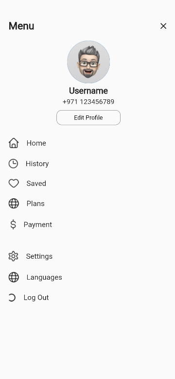
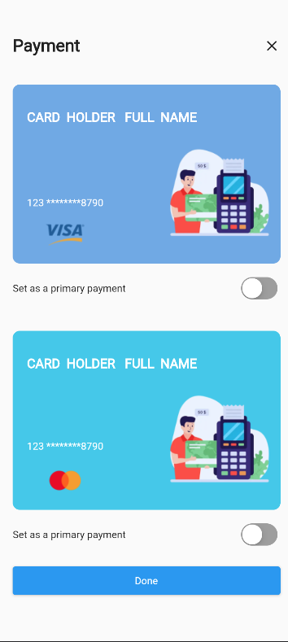

# arab_ai

Flutter version: 3.7.7

credits: https://www.figma.com/file/HwEEw3FBzkArUICQ9KpVzP?node-id=332:10581&comments-enabled=1&viewer=1&locale=en

## screenshot

## feature
Splash  
Login   
Home   
Routing  
Theme  
Dio   
Validation
User Notifications
Logging